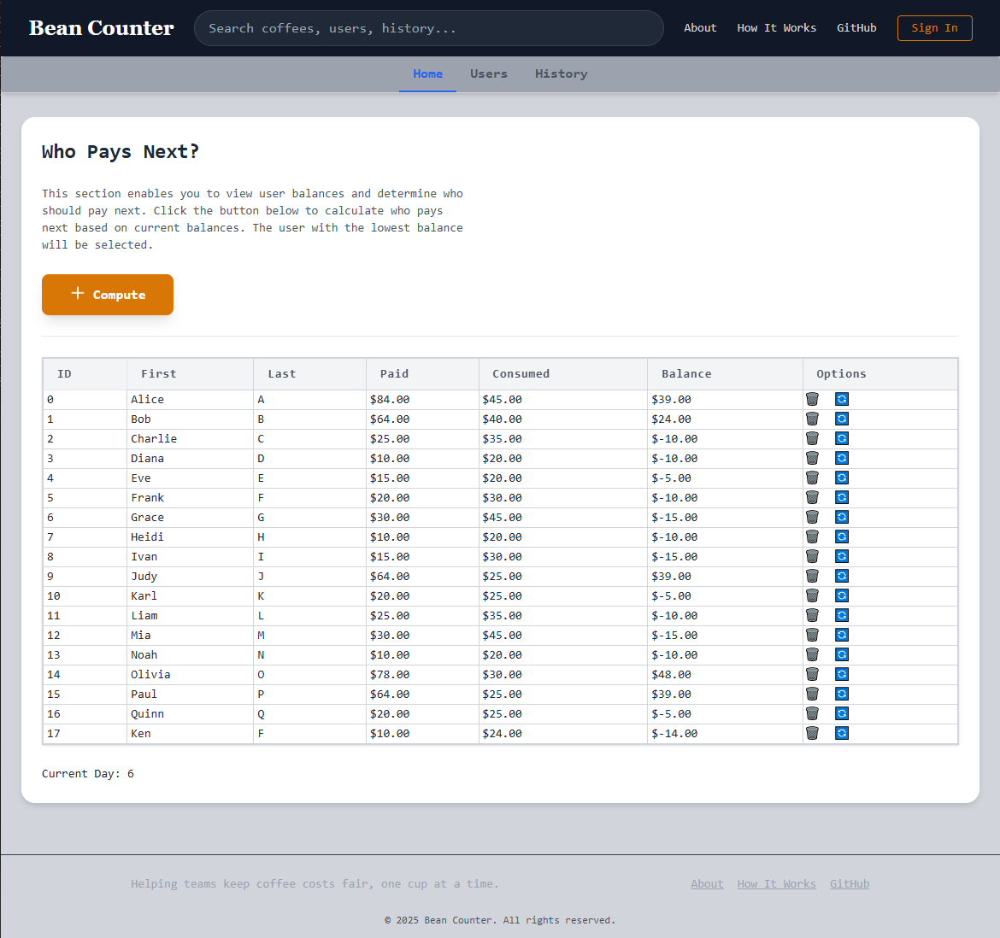
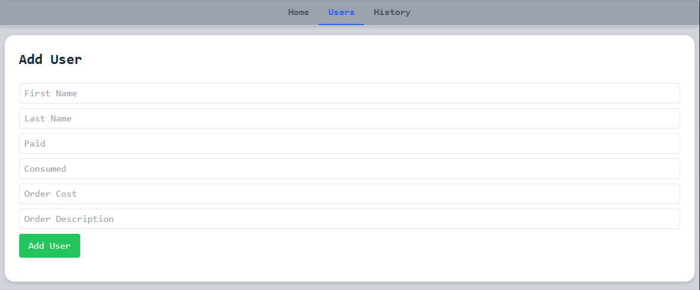
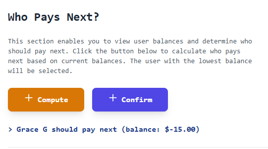
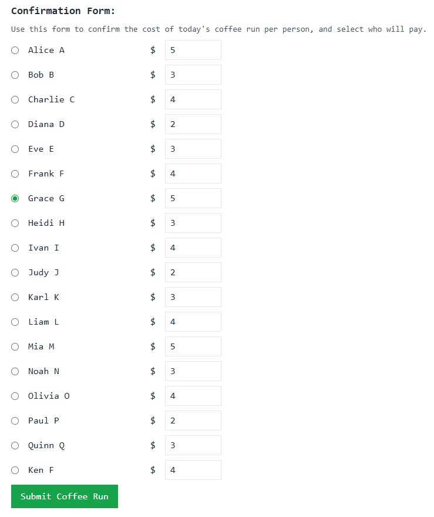
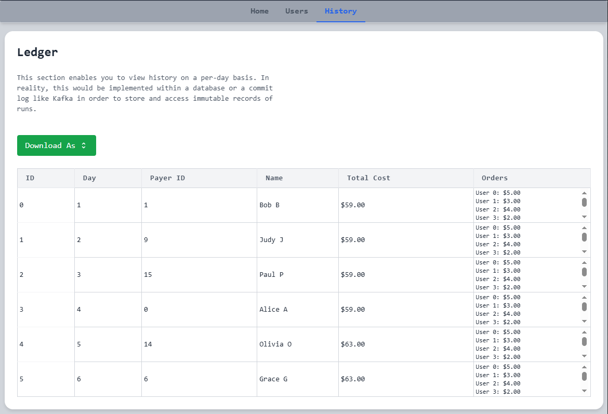

# Bean Counter
---

A simple tool that helps teams share the cost of daily coffee runs fairly by recording orders, tracking payments, and calculating whose turn it is to pay next. This project was developed on Debian GNU/Linux 12 (bookworm) using Go/Gin within the backend and Tailwind CSS + vanilla JavaScript for the frontend.

The **Net Cost Balancing Algorithm** used to ensure long term "fairness" is a version of running balance model.


<br /><br />


## Getting Started
```
bean-counter/
├── cmd/
│   └── main.go          # Entry point for Go backend
├── static/
│   ├── index.html       # Main frontend file
│   └── ...              # JS, images, etc.
├── Makefile             # Build & run commands
├── go.mod / go.sum      # Go modules and dependencies
└── README.md
```

**Requirements**
- Modern Web Browser (Chrome, Firefox, etc.)
- Go 1.22.0 or later
  - [Gin Web Framework](https://github.com/gin-gonic/gin)
  - Go modules enabled via `go.mod`
  - `Gin.Static()` to serve assets
- HTML5
- Internet access for Tailwind CDN in `index.html`
  - [Tailwind CSS](https://tailwindcss.com/)
  - Included via CDN for lightweight usage
  - Custom styles added via `<style>` block inside `index.html`
- Make

```
// Clone repository
git clone https://github.com/ynnekF/bean-counter.git
cd bean-counter

// Install Go dependencies
go mod tidy

// Run the app
make run

// If not using Make
go run cmd/main.go 

// (Optional) Build/Clean
make build
make clean
```

After running the app, it will be served at http://localhost:8080/app

### Functional Requirements
The primary goal is to create software that provides **net cost balancing** among a group of people. 
Idea is to track team members, their choice of beverage and it's respective cost, then rotate/balance payment responsibility among coworkers over time.
- Users can create a record of a person, their order and their order's cost
- Users can remove a person from the systems records
- Users can determine payment responsibility (who should pay next?)
- Users can access simple reports on payment history

**Out of Scope**
- Users can view/edit extensive coffee run history
- Users can access data reports and visualizations
- Users must authenticate to access the service
- Data is persisted in a database
- Coffee run events should be stored in a commit log
  - Provides replay-ability to re-build database
  - Immutable order of events detailing who paid when
- Data can be exported to a CSV
- Cloud deployments
- Ability to search for coffee, users, payment history, etc.
- Docker/Kubernetes support

### Non-Functional Requirements
- Consistency >> Availability
- The system should ensure long-term net cost balancing among the team
- The system should provide low-latency decision making (<200ms)
- The system should be scalable
  - Serve up to 1000 users in a "coffee group"
  - Handle concurrent reads/writes

### API + Interface
Rough idea of what the API will look like.
```
// Return a table-like structure containing each user's information
GET /balances -> Balances[]

// Return name of the user who should pay next
GET /pay -> {user_id}

// Return a ledger-like structure with long-term payment history
GET /ledger -> Ledger

// Return the current day
Get /day -> int

// Create a new user's profile with their order description
POST /profile -> {user_id}

// Remove a user's profile from the group
DELETE /profile

// Update ledger with coffee run information
POST /coffeeRun

```

### Limitations
- No data persistence between sessions
- No external data source means this isn't entirely scalable
- No commit log or immutable ordering of events for the "ledger"
- Missing tests
- No concept of actual dates just an incremental integer

### How to use?
On startup the service has a few profiles pre-loaded for convenience. To add a new user, navigate to the "Users" tab and fill out the form with the profile details.



After the necessary users have been added you can navigate back to the Home tab and click compute.
This will prompt you with the system's choice of profile for who should pay next.



Then, a user can select "Confirm", which then prompts them to fill out a confirmation form with each user's
drink cost that day and an radio button to override who is paying. 



Finally, one can navigate to the "History" tab to view a ledger that stores each day's coffee run details



Users can be removed via the trashcan icon within the table in the Home tab.
User's names, paid and consumed values can be edited in-line within the table.